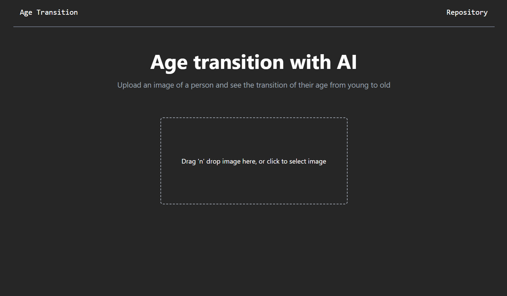

# [Age Transition](https://age-tf.vercel.app/)

This project generates gif of the age transition of a person from young to old. It is bootstrapped with the [`create-next-app`](https://github.com/vercel/next.js/tree/canary/packages/create-next-app).

[](https://age-tf.vercel.app/)

## Tech Stack

- [Next.js](https://nextjs.org)
- [Tailwind CSS](https://tailwindcss.com)
- [Replicate API](https://replicate.com/account)

## Features

- Upload photo of the person
- Generate age transition from 1 to 100
- Download the generated images

## Installation

### 1. Clone the repository

```bash
git clone https://github.com/sadmann7/age-transition.git
```

### 2. Install dependencies

```bash
yarn install
```

### 3. Create a `.env` file

Create a `.env` file in the root directory and add the environment variables as shown in the `.env.example` file. You can get the Replicate API key from [here](https://replicate.com/account). You need to create an account if you don't have one.

### 4. Run the application

```bash
yarn run dev
```

The application will be available at `http://localhost:3000`.

## Deployment

The easiest way to deploy the Next.js app is to use the [Vercel Platform](https://vercel.com/new?utm_medium=default-template&filter=next.js&utm_source=create-next-app&utm_campaign=create-next-app-readme) from the creators of Next.js.

Check out the [Next.js deployment documentation](https://nextjs.org/docs/deployment) for more details.
